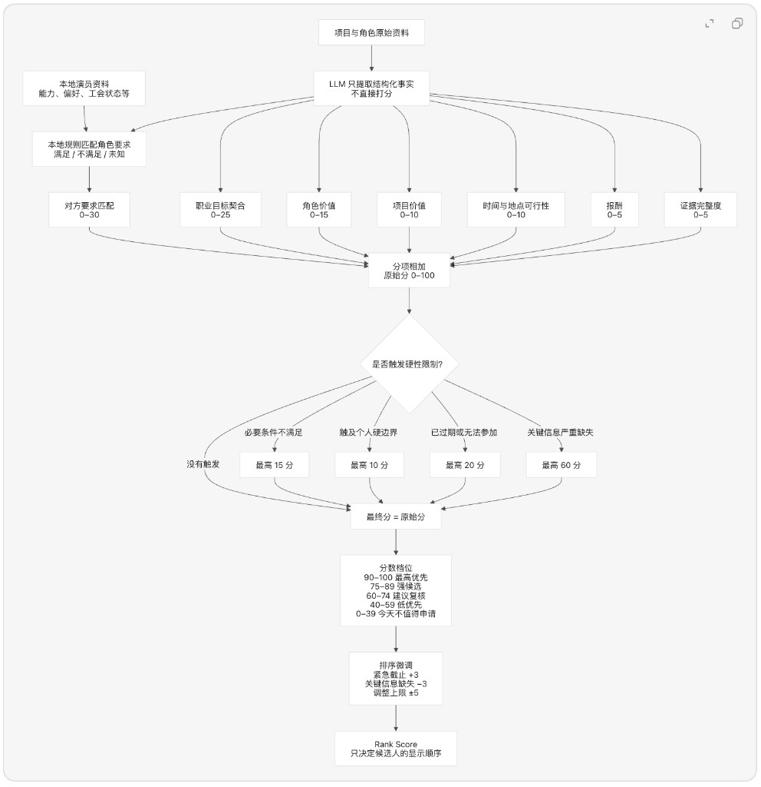

# Backstage Automation Agent

A local-first automation agent for Backstage casting workflows. It scans recent Backstage notification emails, extracts casting projects and roles, scores mutual-selection candidates against an actor profile, and stores auditable rankings in SQLite.

The default workflow is scoring-first and intentionally safe:

- scan the latest day of Backstage notification emails
- refresh projects and roles, then score and rank candidates for that date
- always produce candidate scores and score traces instead of hiding opportunities behind a single filter
- preserve existing scores unless an overwrite is explicitly requested
- store scores, candidate feedback, and calibration proposals for auditability

## Scoring System

Candidates are scored with LLM feature extraction plus local deterministic rules. The diagram below shows raw subscores, hard-constraint caps, score bands, and rank adjustments:



## Quick Start

```bash
python3 -m venv .venv
source .venv/bin/activate
pip install -e .
cp .env.example .env
python3 -m backstage_agent.cli scan --limit 10 --days 1
```

For development dependencies:

```bash
pip install -e '.[dev]'
```

## Configuration

Set environment variables directly or create a `.env` file:

```bash
IMAP_HOST=imap.gmail.com
IMAP_USERNAME=you@example.com
IMAP_PASSWORD=app-password
EMAIL_SUBJECT_KEYWORDS=basic filter
OPENAI_API_KEY=sk-...
AI_BUILDER_API_KEY=...
ACTOR_PROFILE_PATH=profile.example.json
DATABASE_PATH=backstage_agent.sqlite3
```

For Gmail, use an app password rather than your account password. Do not store a Backstage password in `.env`.

Useful settings:

- `LLM_PROVIDER`, `LLM_MODEL`, `MAX_LLM_CALLS_PER_SCAN`: feature-extraction provider, model, and budget.
- `USE_BROWSER_FOR_BACKSTAGE`: enables authenticated Backstage page fetching through a persistent Playwright browser profile.
- `BACKSTAGE_BROWSER_PROFILE_PATH`: local browser profile path for stored Backstage session cookies.
- `BACKSTAGE_BROWSER_HEADLESS`: defaults to false because Backstage may challenge headless browser sessions.
- `BACKSTAGE_BROWSER_CHANNEL`: defaults to `chrome` when available.

## Common Commands

Run these commands from `/Users/sarahtxy/dev/backstage_agent`.

### Scan, extract, and score today

Fetch today's Backstage emails, extract the latest project and role data, and score candidates that do not already have scores. Existing scores are preserved.

```bash
.venv/bin/python -u -m backstage_agent.cli scan \
  --date "$(date '+%Y-%m-%d')" \
  --limit 25
```

### Rerun today's scores only

Delete and rebuild today's candidate scores from projects and roles already stored in SQLite. This does not fetch or extract the source emails again.

```bash
.venv/bin/python -u -m backstage_agent.cli rescore-candidates \
  --date "$(date '+%Y-%m-%d')"
```

### Rerun today's extraction and scores

Fetch and extract today's source data again, then delete and rebuild today's candidate scores. The second command runs only if the scan succeeds.

```bash
.venv/bin/python -u -m backstage_agent.cli scan \
  --date "$(date '+%Y-%m-%d')" \
  --limit 25 &&
.venv/bin/python -u -m backstage_agent.cli rescore-candidates \
  --date "$(date '+%Y-%m-%d')"
```

### Open the candidate dashboard

Start the local score-review dashboard at `http://127.0.0.1:8765/candidates`.

```bash
.venv/bin/python -m backstage_agent.cli ui
```

### Log in to Backstage or check the saved login

Use `backstage-login` to open the persistent browser profile and log in. Use `backstage-login-check` to verify whether the saved session is still valid.

```bash
.venv/bin/python -m backstage_agent.cli backstage-login
.venv/bin/python -m backstage_agent.cli backstage-login-check
```

### Record score feedback and inspect calibration patterns

Replace the example candidate ID, score, components, failure modes, and reason with the values from your review. Then inspect repeated feedback patterns that may justify a scoring-rule change.

```bash
.venv/bin/python -m backstage_agent.cli candidate-feedback 13 \
  --human-score 45 \
  --affected-components identity_match \
  --failure-modes overweighted_signal \
  --reason "Nationality over-weighted."
.venv/bin/python -m backstage_agent.cli calibration-patterns
```

### Turn off the daily job

Stop the loaded job, if present, and keep launchd from starting it again.

```bash
launchctl bootout gui/$(id -u)/com.sarahtxy.backstage-agent.daily 2>/dev/null || true
launchctl disable gui/$(id -u)/com.sarahtxy.backstage-agent.daily
```

### Turn on the daily job

Re-enable the job and load the installed LaunchAgent plist.

```bash
launchctl enable gui/$(id -u)/com.sarahtxy.backstage-agent.daily
launchctl bootstrap gui/$(id -u) \
  "$HOME/Library/LaunchAgents/com.sarahtxy.backstage-agent.daily.plist"
```

## Workflow

1. `scan` fetches recent Backstage emails through IMAP.
2. The parser extracts project notices from each email.
3. The agent optionally fetches Backstage project pages and extracts role, location, and date details.
4. Repeated projects and roles are refreshed in place from the newest digest/page data.
5. `scan` generates role or project-only candidates from the refreshed records.
6. It extracts structured features, matches requirements locally, calculates deterministic scores, and ranks the date's candidates.
7. Existing candidate identities are preserved and reported as skipped.
8. Current component corrections overlay dashboard scores and feed calibration proposals once per candidate/component; the existing coarse CLI feedback path remains available.
9. The CLI prints a scoring-oriented JSON summary and the daily scan can send a macOS notification with `--notify`.

Legacy screening, review, application drafting, decision CLI, and decision dashboard code have been removed. Old `decisions` and `applications` rows may remain in existing SQLite databases, but the application no longer reads or writes them.

Application questions that require personal knowledge, such as swimming ability, wardrobe ownership, exact availability, or comfort with specific scenes, should pause for user confirmation unless the answer is already captured in the actor profile.

## Persistent Backstage Login

The login command opens a browser using `BACKSTAGE_BROWSER_PROFILE_PATH` so you can log in once. The check command verifies whether that stored session is still logged in. Set `USE_BROWSER_FOR_BACKSTAGE=true` to let scans fetch Backstage pages through that authenticated profile. Both commands are listed under [Common Commands](#common-commands).

If Backstage or Cloudflare blocks the automated browser, the agent should stop and report that status instead of trying to bypass the block.

## Daily Automation

The daily local run is defined in `scripts/daily_scan.sh` and scheduled by `launchd/com.sarahtxy.backstage-agent.daily.plist`. launchd runs the script at **9:00, 10:00, 11:00, and 12:00** local time.

The script runs the scoring-first daily workflow with a one-day scan and a limit of 25 emails. The shell sends macOS notifications after inspecting the JSON result.

Retry behavior:

- If `messages_seen == 0` before noon, the job exits quietly and retries at the next hour.
- If the inbox is still empty at the noon attempt, the user is notified once (“No Backstage email today”) and later hours no-op for that date.
- After a successful scan for the day, later hourly runs skip quietly.

State is tracked in `logs/daily-scan-state.json`. Logs go to `logs/daily-scan.out.log` and `logs/daily-scan.err.log`.

The scheduled command refreshes and scores candidates automatically. Use the on/off commands under [Common Commands](#common-commands) to control the schedule.

## Testing

Run the full test suite:

```bash
python3 -m pytest
```

For targeted work, run the relevant test file, for example:

```bash
python3 -m pytest tests/test_parser.py tests/test_project_page_parser.py
```

## Documentation For Future Agents

- `AGENTS.md`: required startup workflow and coding rules for future coding agents.
- `PROJECT_STATE.md`: current capabilities, priorities, constraints, and known issues.
- `CHANGELOG.md`: concise behavior-focused change history.
- `ARCHITECTURE.md`: system flow, module responsibilities, storage, and integrations.
- `docs/module-guide.md`: task-oriented map from likely changes to relevant files and tests.

## Project Status

The repository contains the core local orchestration for email scanning, project and role parsing, candidate-first mutual-selection scoring, feedback and calibration storage, candidate dashboard review, macOS notification, and daily scheduling assets.
